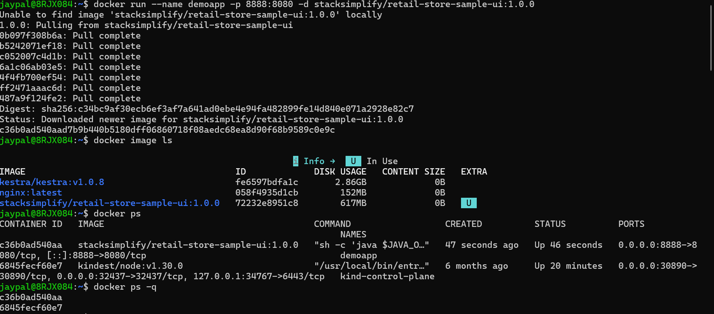
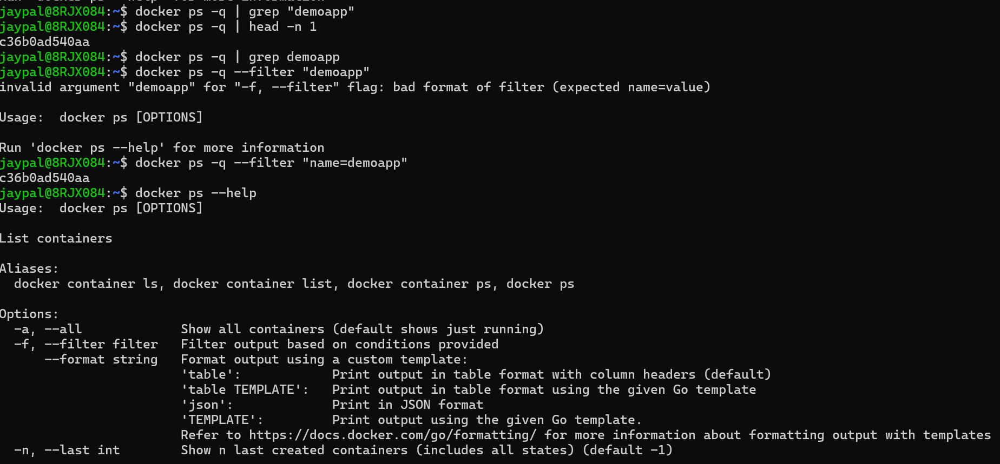
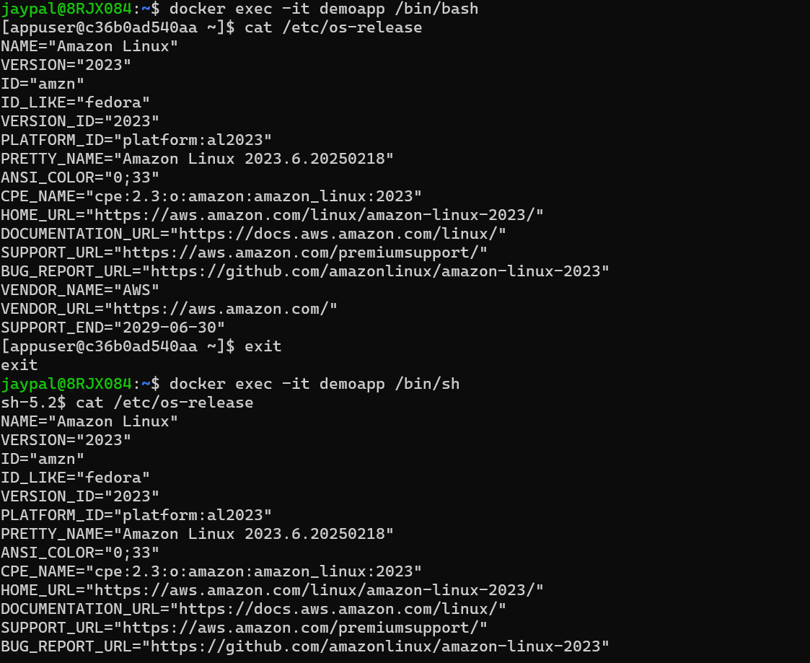
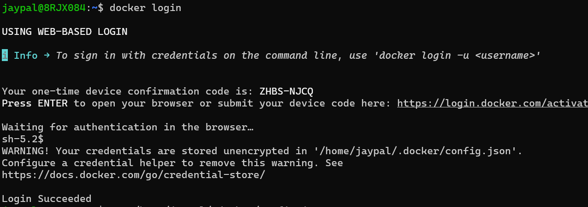

## Docker commands:
```bash
docker run --name demoapp -p 8888:8080 -d stacksimplify/retail-store-sample-ui:1.0.0
# Run retail store UI container in detached mode and map port 8080 (container) to 8888 (host)

docker image ls
# List all available Docker images on the system

docker ps
# Show running containers with details like ports and status

docker ps -q
# Display only container IDs of running containers

docker ps -q | head -n 1
# Get the first running container ID from the list

docker ps -q | grep demoapp
# Again tries filtering by name but fails because output has only IDs

docker ps -q --filter "name=demoapp"
# Correct way to filter container ID using container name

docker exec -it demoapp /bin/sh
# Access running container using sh shell

docker exec -it demoapp /bin/bash
# Access running container using bash shell

cat /etc/os-release
# Check OS details inside the running container (Amazon Linux 2023)

docker login
# Authenticate Docker CLI with Docker Hub using web-based login
```





## Build-Docker-Image-Push-to-DockerHub:

```bash
docker run --name demoapp -p 8888:8080 -d stacksimplify/retail-store-sample-ui:1.0.0
# Run version 1.0.0 of the retail store UI container in detached mode and map port 8080 (container) to 8888 (host)

docker run --name demoapp-v2 -p 8889:8080 -d stacksimplify/retail-store-sample-ui:2.0.0
# Run version 2.0.0 of the retail store UI container in detached mode and map port 8080 (container) to 8889 (host)
```


