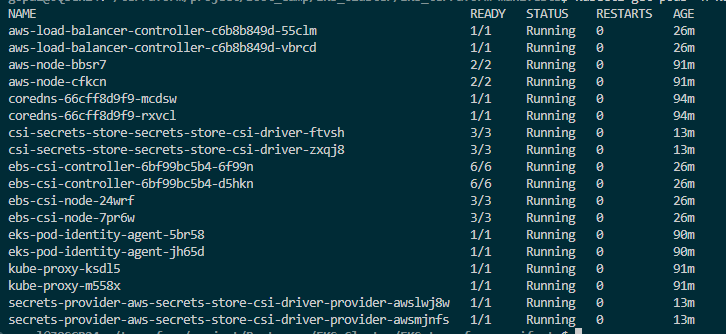

## AWS Addons Installation:

```bash
# Navigate into the Terraform manifests directory for EKS with addons
jaypal@8RJX084:~$ cd Day12

# Initialize Terraform and download required providers/modules
jaypal@8RJX084:~$ terraform init

# Validate Terraform configuration syntax and structure
jaypal@8RJX084:~$ terraform validate

# Preview infrastructure changes before applying
jaypal@8RJX084:~$ terraform plan

# Create or update infrastructure without manual approval prompt
jaypal@8RJX084:~$ terraform apply -auto-approve
```

 
.png>)